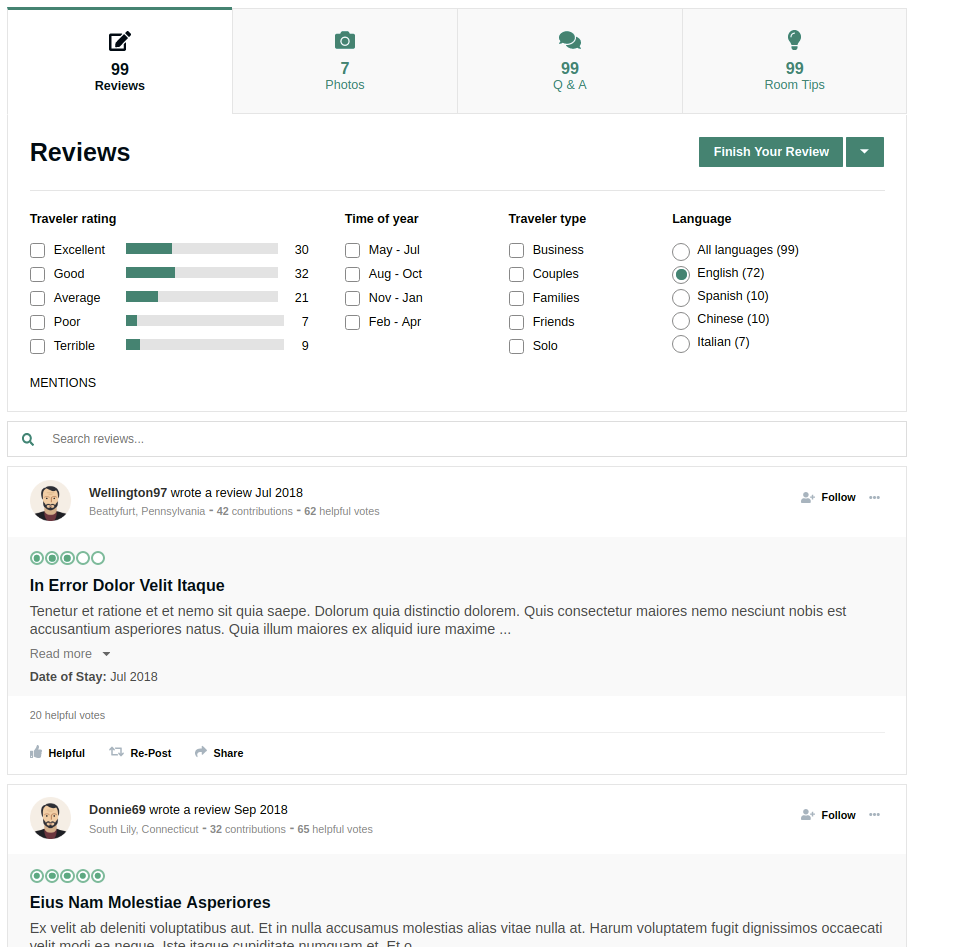

# RickAdvisor - Reviews Microservice

This project consisted of designing, building and deploying a fully functional full-stack web application using a microservices-oriented architecture. Our team chose to model our UI off of a popular TripAdvisor Hotel Reviews page and fully replicate the look, feel and functionality of the application.

This microservice consisted of the Reviews component which allows users to search, filter and list user reviews related to an individual hotel.



## Table of Contents

1. [Usage](#Usage)
2. [Requirements](#requirements)
3. [Development](#development)

## Getting Started

These instructions will get you a copy of the project up and running on your local machine for development and testing purposes. See deployment for notes on how to deploy the project on a live system.

### Prerequisites

From within the root directory:

```sh
npm install -g webpack
npm install
```

### Installing

A step by step series of examples that tell you how to get a development env running

Say what the step will be

```
Give the example
```

And repeat

```
until finished
```

End with an example of getting some data out of the system or using it for a little demo

## Running the tests

To run individual test with Jest:
```
npm run test
```

To run continuous test with Jest:
```
npm run test:watch
```

To run code coverage tests with Jest:
```
npm run test:coverage
```

### End to end testing

Our end-to-end tests consisted of using React-Testing-Library to test interactivity between dynamic page elements including modals, button clicks and tabs.

Example:
```
When user clicks the "Photos" tab, component should switch main view layer to display user-uploaded images and comments.
```

### Coding style

Our codebase utilized ESLint along with the AirBnB style guide to make sure our coding conformed to the rigorous style standards industry code. Our code remained fully up-to-date with the A11y accessibility requirements in order to provide all users with a positive experience on our page.

## Deployment

Our deployment process consisted of using Docker to containerize our web application, which we uploaded to Amazon's ECR registry service. We used our Docker images to spin up four instances of our application using AWS's EC2/ECS horizontal scaling architecture.

## Built With

* [React.js](https://reactjs.org) - Front-end framework used
* [React Context API](https://reactjs.org/docs/context.html) - State Management
* [Node.js](https://nodejs.org/en/) - Server-side solution
* [Express.js](https://expressjs.com/) - Node.js framework used
* [MongoDB](https://www.mongodb.com/) - Data persistence
* [Mongoose](https://mongoosejs.com/) - ORM
* [SCSS](https://sass-lang.com/) - CSS preprocessor

## Contributing

Please read [CONTRIBUTING.md](https://gist.github.com/PurpleBooth/b24679402957c63ec426) for details on our code of conduct, and the process for submitting pull requests to us.

## Related Projects

  - https://github.com/rickadviser/gabe-reviews-proxy
  - https://github.com/rickadviser/gabe-header-service
  - https://github.com/rickadviser/Jared-About-Service
  - https://github.com/rickadviser/RickMorrisonService
  - https://github.com/rickadviser/Pete_Location

## Versioning

We use [SemVer](http://semver.org/) for versioning. For the versions available, see the [tags on this repository](https://github.com/your/project/tags). 

## Authors

* **Gabor Szekely** - *Project lead* - [gaborszekely](https://github.com/gaborszekely)

See also the list of [contributors](https://github.com/your/project/contributors) who participated in this project.

## License

This project is licensed under the MIT License - see the [LICENSE.md](LICENSE.md) file for details
